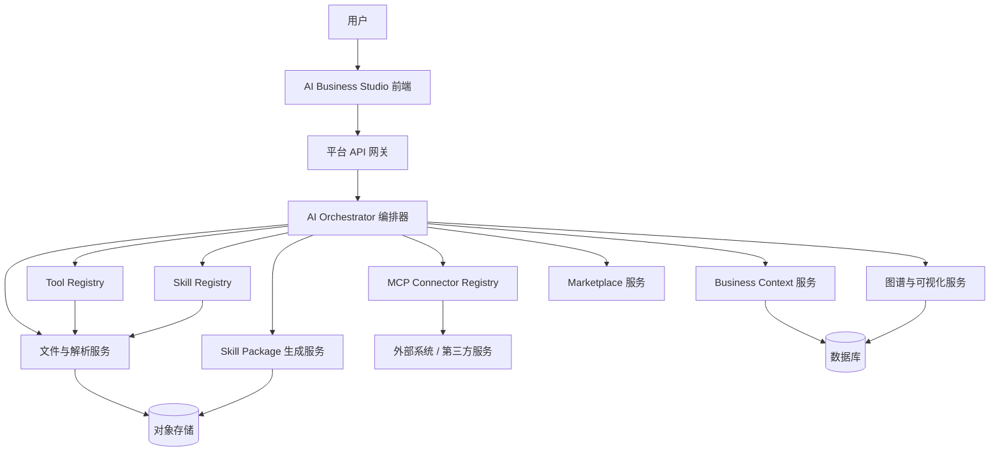
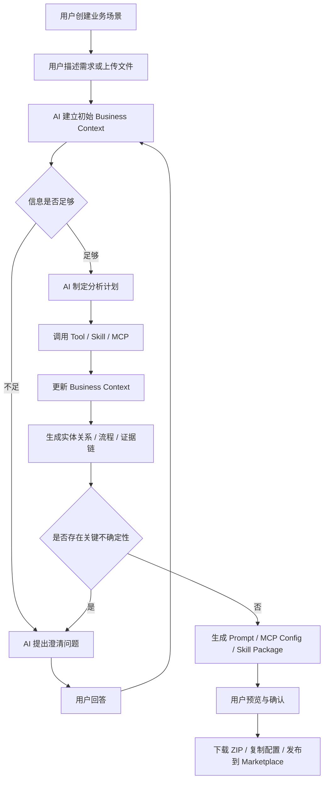

# AI Business Studio 开发文档

版本：v1.0  
日期：2026-07-14  
定位：AI 原生业务场景编辑器 / AI Native Business Scenario Editor

---

## 1. 文档目的

本文档用于指导现有“业务场景蒸馏平台”的升级改造。根据当前产品设想，平台不应继续停留在“根据资料生成一个业务 Skill 包”的单点能力，而应升级为一个完整的 **AI Business Studio（AI 原生业务场景编辑器）**。

它的核心目标是：

> 借鉴 Claude Code、ChatGPT、Cursor、Windsurf 等 AI 编程工具的工作方式，让 AI 像理解代码项目一样理解业务项目，持续分析资料、追问用户、调用工具、复用 Skill、连接 MCP，并最终沉淀出可下载、可安装、可迁移的业务能力包。

本文档将作为后续产品、前端、后端、AI 编排、Skill 生态、MCP 接入、Marketplace 能力市场的统一开发蓝图。

---

## 2. 核心结论

当前项目需要完成一次定位升级：

原定位：

> 业务场景蒸馏平台

新定位：

> **AI Business Studio：一个面向任意行业、任意业务的 AI 原生业务场景编辑器。**

它和 AI 编程工具的类比关系如下：

| AI 编程工具 | AI Business Studio |
|---|---|
| 编辑代码 | 编辑业务 |
| Code Context | Business Context |
| 读写文件、运行命令、搜索代码 | 解析业务资料、生成图谱、查询知识库、调用 MCP |
| 生成代码工程 | 生成业务 Skill 包 |
| 修复 Bug | 修正业务理解 |
| Pull Request / Diff | 业务上下文版本差异 |
| Extension / Plugin | Tool / Skill / MCP / Marketplace |

本项目的长期方向不是写大量固定业务代码，而是维护一套可供 AI 调用的能力资产：

- Tools：原子工具能力，例如文件解析、图谱渲染、流程图生成、压缩打包、Prompt 生成。
- System Skills：系统级可复用能力，例如 ocr-parser、vector-kb、firecrawl-adapter。
- MCP Connectors：外部实时能力，例如 Firecrawl、企业微信、钉钉、SAP、Salesforce、GitHub。
- Prompt Templates：面向不同业务产物的提示词模板。
- Business Context：每个业务场景的结构化上下文。
- Marketplace：能力安装、版本管理、生态扩展。
- Platform Framework：账号、权限、API、任务、会话、文件、版本、前端工作台。

关键原则：

> **代码只负责提供能力，AI 负责理解、判断、编排和生成。**

平台中不应出现大量类似 `if 行业 == 金融`、`if 文件类型 == Excel`、`if 场景 == 审批` 的固定业务逻辑。业务判断应尽量交给 AI，由 AI 根据 Business Context 自主选择工具、Skill 和 MCP。

---

## 3. 产品定义

### 3.1 产品名称

建议名称：

> **AI Business Studio**

中文名称：

> **AI 原生业务场景编辑器**

可选别名：

- Business Studio
- AI Business Editor
- Business Context Studio
- AI 业务工作台

### 3.2 产品一句话描述

AI Business Studio 是一个借鉴 AI 代码编辑器思想构建的业务场景编辑器，用户可以创建业务项目、上传任意业务资料、与 AI 对话对齐理解，并由 AI 自动调用 Tool、Skill 和 MCP，生成可复用的业务 Skill 包、业务提示词、图谱、流程、证据链和 MCP 配置。

### 3.3 目标用户

- 企业内部数字化团队
- AI Agent 应用开发团队
- 业务流程梳理团队
- 行业解决方案团队
- 咨询顾问与交付团队
- 第三方 Agent 平台集成方
- 需要把业务知识沉淀为可执行 AI 能力包的团队

### 3.4 核心使用场景

1. 用户没有任何文件，只通过自然语言描述业务，AI 通过追问逐步构建 Business Context。
2. 用户上传 Excel、PDF、Word、图片、CSV、JSON、代码、历史文档等资料，AI 自动解析并建立业务理解。
3. AI 生成实体关系图、业务流程图、数据血缘图、证据链图。
4. AI 判断当前业务需要复用系统 Skill，例如 ocr-parser、vector-kb。
5. AI 判断当前业务需要外部实时能力，例如 Firecrawl MCP。
6. AI 与用户持续确认关键假设，修正业务理解。
7. AI 生成最终业务 Skill Package，并提供 ZIP 下载。
8. AI 生成第三方 Agent 可使用的 System Prompt、Tool 使用说明、MCP 配置。
9. 用户在同一工作区中持续维护、升级、再生成业务能力。

---

## 4. AI Native 架构原则

### 4.1 AI 是大脑，平台是手和脚

平台不应该把业务流程写死到代码中，而应该提供足够丰富、稳定、可调用的能力，让 AI 自己判断当前需要什么。

AI 负责：

- 理解用户需求
- 阅读和分析文件
- 判断信息是否充分
- 提出澄清问题
- 制定任务计划
- 调用 Tool
- 复用 System Skill
- 调用 MCP
- 更新 Business Context
- 生成图谱、流程、证据链
- 生成 Prompt
- 生成 Skill Package
- 向用户解释推理依据

平台负责：

- 文件存储和解析接口
- Tool/Skill/MCP 注册和调用
- 权限控制
- 会话管理
- 任务调度
- 图谱渲染
- 版本管理
- ZIP 打包
- 下载和导出
- Marketplace 安装和升级
- 前端编辑器体验

### 4.2 能力沉淀优先于项目沉淀

平台长期维护的不是每个行业的固定业务代码，而是跨行业通用能力。

业务场景本身应沉淀为 Business Context，而不是沉淀为大量分散的业务代码。

### 4.3 Skill 与 MCP 独立但可协同

Skill 与 MCP 是两类不同能力：

| 类型 | 定义 | 适合场景 |
|---|---|---|
| Tool | 平台内部原子工具 | 文件解析、图谱生成、ZIP 打包 |
| Skill | Agent 内部可复用能力 | OCR、知识库查询、业务建模、Prompt 生成 |
| MCP | 外部实时连接能力 | 网页抓取、企业系统、第三方平台、数据库 |

示例：

- ocr-parser 是 Skill，用于解析 PDF、图片、扫描件。
- vector-kb 是 Skill，用于查询向量知识库。
- firecrawl-adapter 可以是一个 Skill，用于封装 Firecrawl MCP 的使用规范。
- Firecrawl MCP 是外部实时能力，用于网页抓取、站点内容提取。

AI 应根据业务上下文自己判断什么时候调用哪一类能力。

### 4.4 所有产物都从 Business Context 生成

平台的核心对象不是 Skill，也不是 Prompt，而是：

> **Business Context（业务上下文）**

所有中间分析和最终产物都应围绕 Business Context 构建：

- 业务需求
- 文件资料
- 实体
- 关系
- 规则
- 流程
- 证据
- 假设
- 用户确认
- 复用 Skill
- MCP 引用
- 最终 Prompt
- 最终 Skill Package

---

## 5. 总体架构

### 5.1 架构分层



### 5.2 核心模块

| 模块 | 说明 |
|---|---|
| Business Workspace | 管理业务场景、文件、图谱、输出产物 |
| Business Context Service | 维护业务上下文、版本、证据、确认记录 |
| AI Orchestrator | 负责任务计划、能力选择、调用 Tool/Skill/MCP |
| Tool Registry | 注册和调用平台原子工具 |
| Skill Registry | 管理系统 Skill、用户 Skill、第三方 Skill |
| MCP Registry | 管理 MCP 连接器、鉴权、配置、调用策略 |
| File Parser Service | 解析 PDF、Word、Excel、图片、代码、文本等 |
| Evidence Chain Service | 维护证据链、推理依据、可信度 |
| Graph Renderer | 渲染实体关系、数据血缘、业务流程、证据链 |
| Prompt Generator | 根据 Business Context 生成第三方 Agent Prompt |
| Skill Package Builder | 生成可下载 Skill ZIP 包 |
| Marketplace | 能力市场，安装、升级、启停 Tool/Skill/MCP |
| UI Studio | 三栏式业务编辑器前端 |

---

## 6. Business Workspace 设计

Business Workspace 是用户在平台中的业务工作区，类似 Cursor 或 VSCode 中的项目目录。

### 6.1 工作区结构

```text
业务工作区
├── 电商客服 Agent
│   ├── 数据
│   │   ├── order.xlsx
│   │   ├── sku.csv
│   │   ├── 商品说明.pdf
│   │   └── 售后政策.docx
│   ├── 图谱
│   │   ├── 实体关系
│   │   ├── 数据血缘
│   │   ├── 业务流程
│   │   └── 证据链
│   ├── AI 理解
│   │   ├── 当前假设
│   │   ├── 待确认问题
│   │   └── 用户确认记录
│   └── 输出
│       └── skill-package
│           ├── system_prompt.md
│           └── skills
│               └── ecommerce_customer_service_skill
│                   ├── SKILL.md
│                   └── scripts
├── 合同审批
├── CRM 客户跟进
└── ...
```

### 6.2 工作区能力

- 支持无限创建业务场景。
- 每个业务场景独立维护文件、上下文、图谱、输出和版本。
- 支持上传任意格式文件，优先覆盖常见格式。
- 支持业务场景复制、归档、删除、导出。
- 支持业务上下文版本回溯。
- 支持重新生成 Skill Package。
- 支持将一个业务场景发布为模板。

### 6.3 文件支持优先级

第一阶段建议支持：

- PDF
- Word
- Excel
- CSV
- TXT
- Markdown
- JSON
- 图片
- HTML

第二阶段扩展：

- PPT
- 邮件
- 日志
- 数据库导出
- 代码仓库
- API 文档
- OpenAPI Schema

---

## 7. 三栏式 Business Editor UI

整体交互借鉴 AI 代码编辑器，但编辑对象从代码变为业务。

```text
--------------------------------------------------------------------------------
左侧：Business Explorer       中间：动态编辑区 / 可视化区       右侧：AI Chat
--------------------------------------------------------------------------------
业务场景树                    文件预览 / 图谱 / 流程 / 输出       模型选择
文件列表                      Business Context                  对话输入
图谱入口                      Evidence Chain                    Tool/Skill/MCP
输出入口                      Skill Package                     设置与日志
--------------------------------------------------------------------------------
```

### 7.1 左侧：Business Explorer

左侧用于管理业务项目与资源。

核心功能：

- 新建业务场景
- 上传业务资料
- 展开文件目录
- 查看图谱目录
- 查看 AI 理解目录
- 查看输出产物
- 标记当前业务版本
- 快速进入 Marketplace

建议节点：

```text
业务场景
├── 数据
├── 图谱
├── AI 理解
├── 能力引用
├── 输出
└── 设置
```

### 7.2 中间：动态编辑区

中间区域永远显示当前打开的对象，类似 VSCode 打开文件。

打开不同对象时展示不同视图：

| 打开对象 | 中间区域展示 |
|---|---|
| Excel / CSV | 表格预览、字段识别、数据质量提示 |
| PDF / Word | 文档预览、OCR 结果、章节结构 |
| 图片 | 图片预览、OCR 内容、识别区域 |
| 实体关系 | Graph 图谱 |
| 业务流程 | 流程图 |
| 数据血缘 | Lineage 图 |
| 证据链 | Evidence Chain |
| 当前假设 | AI 理解卡片 |
| Skill Package | 生成结果、目录结构、下载按钮 |
| System Prompt | Prompt 编辑与复制 |
| MCP Config | 配置预览与复制 |

### 7.3 右侧：AI Chat

右侧是 AI 对话与能力控制区。

核心功能：

- 与 AI 对话
- 模型选择
- 查看 AI 当前计划
- 查看 AI 正在调用的 Tool/Skill/MCP
- 手动启用或禁用能力
- 查看系统 Skill
- 查看用户 Skill
- 查看第三方 Skill
- 查看 MCP 配置
- 回复 AI 的确认问题

建议分区：

```text
模型
├── GPT-5
├── Claude
├── Gemini
├── Qwen
└── DeepSeek

能力
├── Tools
├── System Skills
├── User Skills
└── MCP

对话
├── AI 计划
├── AI 问题
├── 用户回复
└── 执行日志
```

### 7.4 AI Thinking 面板

建议在中间或右侧增加 “AI Thinking / AI 理解” 面板。

示例：

```text
AI 当前理解：

我认为该业务的核心流程是：
客户下单 -> 支付 -> 仓库发货 -> 售后处理

可信度：82%

依据：
- order.xlsx：订单状态字段
- 售后政策.docx：退款规则
- 商品说明.pdf：SKU 与分类

待确认：
1. 售后退款是否必须经过人工审核？
2. 大额订单是否有单独风控流程？
```

这能让用户看到 AI 不是黑盒，而是在持续构建可追踪的业务理解。

---

## 8. Business Context 核心数据模型

Business Context 是整个系统的核心对象。它类似 AI 编程工具中的 Code Context，但这里维护的是业务理解。

### 8.1 Business Context 结构

```json
{
  "business_id": "biz_001",
  "name": "电商客服 Agent",
  "goal": "生成面向电商售前售后的客服业务 Skill 包",
  "user_requirements": [],
  "source_files": [],
  "entities": [],
  "relations": [],
  "flows": [],
  "rules": [],
  "terminology": [],
  "evidence": [],
  "data_lineage": [],
  "assumptions": [],
  "questions": [],
  "confirmations": [],
  "tool_usages": [],
  "skill_references": [],
  "mcp_references": [],
  "generated_prompts": [],
  "generated_packages": [],
  "versions": []
}
```

### 8.2 核心字段说明

| 字段 | 说明 |
|---|---|
| user_requirements | 用户自然语言需求 |
| source_files | 上传文件及解析结果 |
| entities | 业务实体，例如客户、订单、合同、审批人 |
| relations | 实体关系，例如客户拥有订单 |
| flows | 业务流程，例如下单、支付、发货、售后 |
| rules | 业务规则，例如退款条件、审批条件 |
| terminology | 业务术语表 |
| evidence | AI 推理依据 |
| data_lineage | 数据来源与流向 |
| assumptions | AI 当前假设 |
| questions | AI 待确认问题 |
| confirmations | 用户确认记录 |
| tool_usages | Tool 调用记录 |
| skill_references | 复用 Skill 记录 |
| mcp_references | MCP 引用记录 |
| generated_prompts | 生成的 Prompt |
| generated_packages | 生成的 Skill 包 |
| versions | 上下文版本 |

### 8.3 Business Context 版本机制

每次关键变更都应生成版本：

- 上传新文件
- AI 完成一轮分析
- 用户确认关键假设
- 生成新图谱
- 生成新 Prompt
- 生成 Skill Package
- 手动修改业务上下文

版本记录应包括：

- 版本号
- 变更摘要
- 触发来源
- 时间
- 操作者
- AI 模型
- 相关证据
- 可回滚快照

---

## 9. Tool / Skill / MCP 能力体系

### 9.1 Tool：原子工具

Tool 是平台提供给 AI 调用的最小原子能力，但平台基础架构不维护固定的业务 Tool 清单。运行时只扫描 `tools/` 包中通过标准 `@tool(description="...")` 声明的工具，自动生成 schema 并挂载给模型；新增或替换能力不需要修改 Agent 循环。

Tool 设计要求：

- 输入输出必须结构化。
- 必须有清晰描述，便于 AI 判断何时调用。
- 必须记录调用日志。
- 必须返回可追踪错误。
- 尽量保持业务无关。
- Tool 与 Skill、MCP 分别注册、分别追踪，不能用 Tool 伪装 Skill 调用。

### 9.2 System Skill：系统级能力资产

System Skill 是平台内置、不可随意卸载的可复用能力。

首批建议沉淀：

- ocr-parser：PDF、图片、扫描件解析。
- vector-kb：向量知识库检索。
- file-understanding：通用文件理解。
- graph-builder：关系图谱构建。
- flow-builder：业务流程构建。
- evidence-chain-builder：证据链构建。
- prompt-generator：业务场景提示词生成。
- skill-package-builder：Skill 包生成。
- firecrawl-adapter：封装 Firecrawl MCP 的调用策略。

System Skill 要求：

- 系统级锁定，普通用户不能删除。
- 支持启用、停用和版本升级。
- 可被业务场景引用。
- 生成 Skill Package 时可以声明依赖，而不是复制一份。
- 一个 Skill 是以 `SKILL.md` 为入口，连同 `scripts/`、`references/`、`assets/`、依赖声明等组成的完整目录；内部脚本不是独立 Tool。
- Registry 只读取标准 `SKILL.md` frontmatter 做渐进式发现，激活后才读取正文和所需资源，不要求 `manifest.json`。
- 整个原始 Skill 目录通过只读文件系统映射暴露在 `/skills/<name>`；平台安装归属、密钥和运行状态保存在 Skill 包外。
- Skill 的命令和依赖安装统一通过 Studio 通用执行能力完成；模型使用的 `python` 与 `python -m pip` 始终解析到 Studio 管理的 venv，不使用系统全局 Python。
- 所有 Skill 共享一个系统级 Studio venv。该环境位于业务场景目录之外，由平台自动创建、串行更新和复用；场景目录只保存业务文件与产物，不保存依赖环境。

### 9.2.1 Skill 运行环境生命周期

- Studio 首次需要执行 Skill 时自动创建系统级共享 venv，无需另外安装外部运行时。
- 通用执行能力将当前业务场景映射为可写的 `/workspace`，将完整 Skill 根目录映射为只读的 `/skills`；切换场景只切换工作区映射，不复制运行环境。
- 依赖通过 `python -m pip install -r /skills/<name>/requirements.txt` 安装到共享 venv。平台记录需求文件摘要，避免每次调用重复安装。
- 凭据按实际执行的 Skill 注入命令环境，不写入 Skill 包或业务场景文件。
- `skill_activation`、`skill_resource`、`sandbox_command`、`tool_call`、`mcp_call` 分层记录；只有真实父子 ID 才在前端归组。
- 安装、查看说明、调用内部资源与执行命令不需要逐脚本人工确认；真正需要用户业务决策时才进入问答中断。

### 9.3 User Skill：用户自定义能力

用户可以在某个业务场景下生成或安装自己的 Skill。

能力：

- 创建
- 编辑
- 测试
- 安装
- 卸载
- 发布到团队
- 发布到 Marketplace

### 9.4 MCP：外部实时能力

MCP 用于连接平台外部能力。

示例：

- Firecrawl：网页抓取与内容提取。
- 企业微信：消息通知、组织架构。
- 钉钉：审批、组织、机器人。
- SAP：业务数据。
- Salesforce：CRM 数据。
- GitHub / GitLab：代码、文档、Issue。
- Neo4j：图数据库。
- Redis / Kafka：运行时数据能力。

MCP 配置应包含：

- 名称
- 描述
- 连接方式
- 鉴权信息
- 可用工具列表
- 调用限制
- 适用场景
- 安全策略

### 9.5 能力选择原则

AI 调用能力时应遵循：

1. 优先复用已存在 System Skill。
2. 如果需要外部实时数据，调用 MCP。
3. 如果只是平台内部处理，调用 Tool。
4. 如果业务需要长期复用，生成或引用 Skill。
5. 如果能力缺失，AI 应提出建议，而不是编造结果。

---

## 10. AI Orchestrator 工作流

AI Orchestrator 是平台大脑的执行层，负责让 AI 有计划地使用能力。

### 10.1 标准工作流



### 10.2 AI 任务计划

AI 每次执行前应形成可见计划：

```text
本轮计划：
1. 解析上传的 order.xlsx 和 售后政策.docx。
2. 提取核心业务实体：客户、订单、商品、售后单、退款。
3. 构建订单与售后的实体关系。
4. 识别退款审批规则。
5. 标记需要用户确认的问题。
```

### 10.3 AI 确认闭环

AI 不应在信息不足时强行生成。

需要提问的情况：

- 文件之间存在冲突。
- 业务规则缺少边界条件。
- AI 识别出多个可能解释。
- 关键流程缺少责任人。
- 生成 Skill 需要运行环境信息。
- MCP 调用需要鉴权或第三方平台选择。

用户回答后，AI 应更新 Business Context，并保留确认记录。

---

## 11. Evidence Chain 与 Data Lineage

### 11.1 Evidence Chain 定义

Evidence Chain 是 AI 推理的可追踪证据链。

它不是普通关系图，而是把每个判断背后的来源、依据、可信度展示出来。

示例：

```text
结论：订单完成后可进入售后流程

证据链：
订单状态 = completed
    来源：order.xlsx / status 字段
    可信度：92%
    ↓
售后申请需要订单已完成
    来源：售后政策.docx / 第 3 节
    可信度：88%
    ↓
订单完成 -> 售后申请
    AI 推理关系
    可信度：90%
```

### 11.2 Evidence 数据结构

```json
{
  "evidence_id": "ev_001",
  "claim": "订单完成后可以发起售后",
  "source_type": "file",
  "source_id": "file_001",
  "location": {
    "page": 3,
    "row": null,
    "column": null,
    "text_range": "售后申请条件"
  },
  "confidence": 0.9,
  "reason": "售后政策中明确说明已完成订单可申请售后",
  "related_entities": ["订单", "售后申请"]
}
```

### 11.3 Data Lineage 定义

Data Lineage 用于展示数据来源、加工、流向和最终产物。

示例：

```text
order.xlsx
    ↓ 解析字段
订单实体
    ↓ 与 sku.csv 关联
订单-商品关系
    ↓ 进入 Business Context
业务流程图
    ↓ 生成
Skill Package
```

### 11.4 价值

Evidence Chain 和 Data Lineage 能解决 AI 业务建模中最关键的问题：

- 用户为什么相信 AI？
- AI 的结论来自哪里？
- 业务规则是否有依据？
- 文件变化会影响哪些业务产物？
- Skill Package 是否可审计？

---

## 12. Skill Package 生成规范

最终产物应是可下载、可安装、可迁移的业务场景 Skill 能力包。

需要特别明确：平台内部可以维护 Business Context、Evidence Chain、Data Lineage、图谱 JSON、运行日志等数据，但最终交付给用户或第三方 Agent 的核心产物不是泛化资料包，而是一个标准化的 `skill-package`。

也就是说，最终交付物应围绕：

- 根目录的 `system_prompt.md`
- `skills` 目录下的一个或多个业务 Skill
- 每个 Skill 自己的 `SKILL.md`
- 每个 Skill 可选或必需的 `scripts` 脚本能力

来组织。

### 12.1 标准能力包结构

```text
skill-package
├── system_prompt.md
└── skills
    ├── ecommerce_customer_service_skill
    │   ├── SKILL.md
    │   └── scripts
    │       ├── parse_orders.py
    │       ├── match_refund_rules.py
    │       └── build_customer_answer.py
    └── contract_approval_skill
        ├── SKILL.md
        └── scripts
            ├── extract_contract_terms.py
            └── evaluate_approval_path.py
```

如果以 ZIP 形式下载，则 ZIP 内部也应保持上述结构：

```text
skill-package.zip
└── skill-package
    ├── system_prompt.md
    └── skills
        └── xxx_skill
            ├── SKILL.md
            └── scripts
                └── xxxx.py
```

### 12.2 system_prompt.md 规范

`system_prompt.md` 是整个业务场景能力包的总入口，用于告诉第三方 Agent 或运行平台：

- 当前业务场景是什么。
- Agent 在该业务场景中的角色是什么。
- 可以调用哪些业务 Skill。
- 什么时候调用哪个 Skill。
- 哪些系统级 Skill 或 MCP 可以被引用。
- 遇到信息不足时如何向用户追问。
- 回答时如何使用证据、规则和业务边界。
- 哪些事情不能做。

建议结构：

```md
# 电商客服业务场景 System Prompt

## 业务定位

你是一个电商客服业务 Agent，负责理解订单、商品、支付、物流、售后和退款相关问题。

## 可用 Skills

- ecommerce_customer_service_skill：用于处理订单、商品、物流、售后相关业务问题。
- refund_policy_skill：用于判断退款条件、退款路径和异常处理。

## 可用系统能力

- ocr-parser：当用户提供 PDF、图片、扫描件时使用。
- vector-kb：当需要查询企业知识库时使用。
- firecrawl-adapter：当需要访问公开网页资料时使用。

## 工作原则

1. 优先根据业务资料和已确认规则回答。
2. 当规则不明确时，必须向用户追问。
3. 不要编造不存在的业务规则。
4. 涉及金额、审批、退款、合同等关键判断时，需要说明依据。
```

### 12.3 skills 目录规范

`skills` 目录下可以包含一个或多个业务 Skill。

命名建议：

```text
{business_domain}_{capability}_skill
```

示例：

- `ecommerce_customer_service_skill`
- `refund_policy_skill`
- `contract_approval_skill`
- `crm_followup_skill`

每个 Skill 目录必须包含：

```text
xxx_skill
├── SKILL.md
└── scripts
    └── xxxx.py
```

### 12.4 SKILL.md 规范

`SKILL.md` 是单个业务 Skill 的说明书和执行入口。它应告诉 Agent：

- 这个 Skill 解决什么业务问题。
- 什么情况下应该调用它。
- 输入是什么。
- 输出是什么。
- 依赖哪些系统 Skill、Tool 或 MCP。
- 可以调用哪些脚本。
- 执行时需要遵守哪些业务规则。
- 不确定时如何向用户追问。

建议结构：

```md
# ecommerce_customer_service_skill

## Description

用于处理电商客服中的订单查询、商品解释、物流状态、售后申请、退款规则判断等业务问题。

## When To Use

- 用户询问订单状态、支付状态、物流状态。
- 用户询问商品信息、SKU、库存或活动规则。
- 用户发起售后、退款、换货、补发相关问题。
- Agent 需要根据业务资料判断客服处理路径。

## Inputs

- 用户问题
- 当前业务上下文
- 订单数据
- 商品数据
- 售后政策

## Outputs

- 面向用户的业务回答
- 判断依据
- 需要继续确认的问题
- 可执行的下一步建议

## Dependencies

- system skill: ocr-parser
- system skill: vector-kb
- mcp: firecrawl（仅当需要查询公开网页资料时）

## Scripts

- scripts/parse_orders.py：解析订单数据。
- scripts/match_refund_rules.py：匹配退款规则。
- scripts/build_customer_answer.py：生成客服回答草稿。

## Rules

1. 不得编造未在业务资料中出现的退款规则。
2. 订单状态、退款金额、审批结果必须给出依据。
3. 如果资料中存在冲突，先说明冲突并向用户确认。
```

### 12.5 scripts 目录规范

`scripts` 目录用于放置该业务 Skill 需要的脚本能力。

脚本原则：

- 脚本应提供可复用能力，不应写死某个用户的一次性问答。
- 脚本输入输出应结构化，便于 Agent 调用和调试。
- 脚本名称应表达业务动作。
- 复杂逻辑应拆成多个小脚本，而不是堆在一个大脚本中。
- 涉及外部服务时，应通过 MCP 或平台配置读取，不应在脚本中写死密钥。

示例：

```text
scripts
├── parse_orders.py
├── normalize_sku.py
├── match_refund_rules.py
├── evaluate_risk_flags.py
└── build_customer_answer.py
```

### 12.6 依赖复用原则

如果某个能力已经是系统 Skill，不应重复生成一份。

例如：

- PDF OCR 依赖 ocr-parser。
- 知识库查询依赖 vector-kb。
- 网页抓取依赖 firecrawl-adapter + Firecrawl MCP。

业务 Skill 应在 `SKILL.md` 或 `system_prompt.md` 中声明这些依赖关系和调用说明。

### 12.7 平台内部产物与最终交付物的边界

平台内部可以保存下列内容，用于审计、回溯和重新生成：

- Business Context
- Evidence Chain
- Data Lineage
- 实体关系图
- 业务流程图
- AI Run 日志
- 用户确认记录
- Tool/Skill/MCP 调用记录

但默认下载给用户的业务能力包应保持轻量、清晰，并以 `skill-package` 标准目录为准。若未来需要导出审计版，可以作为高级选项额外生成 `debug` 或 `artifacts` 附录目录，但不应改变核心结构。

---

## 13. Marketplace 能力市场

Marketplace 是平台长期生态价值的核心。

### 13.1 能力类型

- Tool
- System Skill
- User Skill
- Third-party Skill
- MCP Connector
- Prompt Template
- Graph Renderer
- Business Template

### 13.2 Marketplace 功能

- 搜索能力
- 查看能力详情
- 安装能力
- 升级能力
- 禁用能力
- 版本回滚
- 查看依赖
- 查看权限要求
- 查看调用成本
- 发布团队内部能力
- 发布第三方能力

### 13.3 系统级能力保护

系统级能力应有保护策略：

- 普通用户不能卸载。
- 管理员可控制启停。
- 平台升级时统一迁移。
- 被业务场景引用时不能直接删除。

---

## 14. 后端开发设计

### 14.1 推荐服务划分

| 服务 | 职责 |
|---|---|
| api-gateway | 统一 API、鉴权、限流 |
| workspace-service | 业务场景、目录、文件关系 |
| file-service | 文件上传、存储、解析任务 |
| context-service | Business Context 管理 |
| orchestrator-service | AI 编排、任务计划、能力调用 |
| tool-service | Tool 注册与调用 |
| skill-service | Skill 管理、依赖、版本 |
| mcp-service | MCP 配置、鉴权、调用 |
| graph-service | 图谱、流程、证据链渲染 |
| package-service | Skill ZIP 生成和下载 |
| marketplace-service | 能力市场 |
| audit-service | 操作日志、调用日志、安全审计 |

### 14.2 关键 API 草案

业务场景：

```http
POST /api/businesses
GET /api/businesses
GET /api/businesses/{business_id}
PATCH /api/businesses/{business_id}
DELETE /api/businesses/{business_id}
```

文件：

```http
POST /api/businesses/{business_id}/files
GET /api/businesses/{business_id}/files
GET /api/files/{file_id}/preview
POST /api/files/{file_id}/parse
```

对话与 AI 编排：

```http
POST /api/businesses/{business_id}/chat
GET /api/businesses/{business_id}/runs/{run_id}
POST /api/businesses/{business_id}/confirmations
```

Business Context：

```http
GET /api/businesses/{business_id}/context
PATCH /api/businesses/{business_id}/context
GET /api/businesses/{business_id}/context/versions
POST /api/businesses/{business_id}/context/rollback
```

图谱：

```http
GET /api/businesses/{business_id}/graphs/entity
GET /api/businesses/{business_id}/graphs/flow
GET /api/businesses/{business_id}/graphs/lineage
GET /api/businesses/{business_id}/graphs/evidence
```

能力：

```http
GET /api/tools
GET /api/skills
GET /api/mcp-connectors
POST /api/businesses/{business_id}/skills/attach
POST /api/businesses/{business_id}/mcp/attach
```

输出：

```http
POST /api/businesses/{business_id}/outputs/prompt
POST /api/businesses/{business_id}/outputs/skill-package
GET /api/packages/{package_id}/download
```

Marketplace：

```http
GET /api/marketplace/items
GET /api/marketplace/items/{item_id}
POST /api/marketplace/items/{item_id}/install
POST /api/marketplace/items/{item_id}/upgrade
```

---

## 15. 前端开发设计

### 15.1 页面结构

核心页面：

- Studio 首页
- Business Editor 主页面
- Marketplace 页面
- Skill 管理页面
- MCP 管理页面
- 系统设置页面
- 运行日志页面

### 15.2 Business Editor 主页面

建议组件：

- `BusinessExplorer`
- `FileUploader`
- `ResourceTree`
- `EditorTabs`
- `FilePreviewPanel`
- `GraphViewer`
- `FlowViewer`
- `EvidenceChainViewer`
- `DataLineageViewer`
- `BusinessContextPanel`
- `OutputPanel`
- `AIChatPanel`
- `CapabilityPanel`
- `ModelSelector`
- `RunLogPanel`

### 15.3 前端交互要求

- 左侧点击任何资源，中间以 Tab 打开。
- 支持多个中间 Tab 切换。
- 右侧 Chat 不随中间 Tab 丢失。
- 上传文件后自动触发解析任务。
- AI 生成新问题时右侧高亮。
- AI 生成图谱时中间可实时刷新。
- Skill Package 生成成功后输出区显示下载按钮。
- MCP Config 支持一键复制。
- System Skill 显示锁定标识。
- User Skill 和 Third-party Skill 显示启停、卸载、升级。

---

## 16. 数据库模型建议

### 16.1 核心表

```text
users
teams
businesses
business_files
business_contexts
business_context_versions
entities
relations
flows
rules
evidence_items
data_lineage_items
ai_runs
ai_messages
tool_definitions
tool_invocations
skills
skill_versions
business_skill_refs
mcp_connectors
mcp_configs
business_mcp_refs
packages
marketplace_items
audit_logs
```

### 16.2 关键关系

- 一个用户可创建多个 business。
- 一个 business 可包含多个 file。
- 一个 business 有一个当前 Business Context 和多个历史版本。
- 一个 Business Context 可关联多个 entity、relation、flow、rule、evidence。
- 一个 business 可引用多个 Skill 和 MCP。
- 一个 package 对应某个 Business Context 版本。
- 每次 AI 调用都生成 ai_run 和 tool_invocation 记录。

---

## 17. 安全与权限

### 17.1 文件安全

- 文件上传需限制大小和类型。
- 对可执行文件、压缩包、脚本文件进行隔离处理。
- OCR 和解析结果需记录来源。
- 文件删除应保留审计记录。

### 17.2 MCP 安全

- MCP 鉴权信息必须加密存储。
- 不应把密钥直接写入 Skill Package。
- 导出的 MCP_CONFIG 只能包含示例或占位符。
- 外部调用需记录调用日志。
- 高风险 MCP 需要用户确认。

### 17.3 AI 安全

- AI 不能无确认执行破坏性操作。
- AI 生成结论必须尽量附带证据。
- 对低可信结论应标注“不确定”。
- Prompt 和 Skill 导出前应进行敏感信息扫描。

---

## 18. 改造实施路线

### 阶段 0：统一定位和文档

目标：

- 将项目定位统一为 AI Business Studio。
- 确认 Business Context 为核心对象。
- 确认 Tool / Skill / MCP 三层能力体系。
- 确认三栏式 Business Editor UI。

交付：

- 本开发文档。
- 产品原型草图。
- 模块边界说明。

### 阶段 1：MVP 版本

目标：

- 支持创建业务场景。
- 支持上传 PDF、Word、Excel、CSV、图片。
- 支持右侧 AI Chat。
- 支持基础 Business Context。
- 支持实体关系和业务流程生成。
- 支持 Prompt 生成。
- 支持基础 Skill ZIP 生成。

重点：

- 先跑通完整闭环。
- 能力可以少，但链路必须完整。

MVP 闭环：

```text
创建业务 -> 上传资料 -> AI 分析 -> 用户确认 -> 生成图谱 -> 生成 Prompt -> 生成 Skill ZIP
```

### 阶段 2：能力体系化

目标：

- 建立 Tool Registry。
- 建立 Skill Registry。
- 接入 ocr-parser、vector-kb。
- 新增 firecrawl-adapter。
- 支持 MCP 配置复制和引用。
- 增加 Evidence Chain。
- 增加 Data Lineage。

### 阶段 3：编辑器体验升级

目标：

- 完成三栏式 Business Editor。
- 中间支持多 Tab。
- 文件预览体验完善。
- 图谱可交互。
- AI Thinking 可视化。
- Business Context 可视化编辑。
- 输出产物可预览、对比、下载。

### 阶段 4：Marketplace 与生态

目标：

- 支持能力市场。
- 支持安装第三方 Skill。
- 支持安装 MCP Connector。
- 支持团队内部发布。
- 支持能力版本升级。
- 支持业务模板市场。

### 阶段 5：企业级能力

目标：

- 多团队与权限。
- 审计日志。
- 私有化部署。
- 企业知识库。
- 企业 MCP 网关。
- 业务上下文版本对比。
- 批量业务场景生成。
- 与第三方 Agent 平台集成。

---

## 19. 当前项目改造建议

如果当前项目已经有业务场景蒸馏相关代码，建议不要直接推倒重写，而是按下面方式渐进改造。

### 19.1 先抽象核心对象

优先新增：

- Business Workspace
- Business Context
- Tool Registry
- Skill Registry
- MCP Registry

让原有功能逐步迁移到这些对象之上。

### 19.2 把写死逻辑迁移为 Tool 或 Skill

现有代码中如果存在固定业务逻辑，应分类处理：

| 原有逻辑 | 改造方向 |
|---|---|
| 文件解析 | Tool |
| OCR | System Skill |
| 图谱生成 | Tool 或 System Skill |
| Prompt 拼接 | Prompt Generator Skill |
| ZIP 打包 | Tool |
| 行业判断 | 交给 AI，通过 Business Context 表达 |
| 第三方抓取 | MCP + firecrawl-adapter |

### 19.3 UI 先改主结构

先把页面改为三栏结构：

- 左侧业务资源树。
- 中间内容展示。
- 右侧 AI 对话。

即使中间视图初期比较简单，也要先确立编辑器范式。

### 19.4 先做一个标杆业务场景

建议选择一个代表性业务作为验证：

- 电商客服 Agent
- 合同审批
- CRM 客户跟进

用它验证完整链路：

```text
上传资料 -> AI 分析 -> 图谱 -> 证据链 -> Prompt -> Skill ZIP -> 第三方 Agent 使用
```

---

## 20. 验收标准

### 20.1 MVP 验收

MVP 版本应满足：

- 用户能创建业务场景。
- 用户能上传至少 5 类常见文件。
- AI 能基于文件和描述生成 Business Context。
- AI 能提出至少一个有意义的澄清问题。
- 用户确认后，Business Context 会更新。
- 平台能生成实体关系图。
- 平台能生成业务流程图。
- 平台能生成 System Prompt。
- 平台能生成 Skill ZIP。
- ZIP 中包含标准 `skill-package` 目录。
- `skill-package` 根目录包含 `system_prompt.md`。
- `skill-package/skills` 下至少包含一个业务 Skill。
- 每个业务 Skill 包含 `SKILL.md`，并可按需包含 `scripts` 脚本目录。

### 20.2 架构验收

架构层面应满足：

- 新业务不需要新增固定业务代码。
- 新能力通过 Tool、Skill 或 MCP 注册。
- System Skill 可被多个业务场景复用。
- MCP 与 Skill 独立管理。
- Business Context 是所有产物的来源。
- AI 调用记录可追踪。
- 关键结论有证据链。

### 20.3 用户体验验收

用户体验应满足：

- 用户能像使用编辑器一样管理业务场景。
- 左侧资源树清晰。
- 中间视图能打开文件、图谱和输出。
- 右侧 AI 对话能持续工作。
- AI 的理解和待确认问题可见。
- 生成结果可下载、可复制、可安装。

---

## 21. 风险与应对

### 21.1 风险：AI 理解不稳定

应对：

- 引入 Evidence Chain。
- 引入用户确认闭环。
- 对低可信结论做显式标记。
- 保留上下文版本。

### 21.2 风险：能力边界混乱

应对：

- 明确 Tool / Skill / MCP 定义。
- 所有能力必须注册到 Registry。
- 禁止业务代码绕过 Registry 私自调用。

### 21.3 风险：Skill 包不可迁移

应对：

- 定义标准 `skill-package` 目录结构。
- 根目录统一使用 `system_prompt.md` 作为业务场景总入口。
- 所有业务能力放入 `skills/{xxx_skill}/SKILL.md`。
- 脚本能力放入对应 Skill 的 `scripts` 目录。
- 系统 Skill、MCP、外部依赖在 `system_prompt.md` 或 `SKILL.md` 中声明，不把密钥和私有配置写入包内。

### 21.4 风险：前端变成普通管理后台

应对：

- 坚持 Business Editor 范式。
- 左侧资源树、中间动态编辑区、右侧 AI Chat 是主结构。
- 不做传统表单堆叠式后台。

---

## 22. 开发任务拆分建议

### 第一批任务

1. 新增 Business 数据模型。
2. 新增文件上传与文件列表。
3. 新增 Business Context JSON 存储。
4. 新增右侧 AI Chat 接口。
5. 新增 AI Run 记录。
6. 新增基础 Prompt 生成。
7. 新增 Skill ZIP 生成。
8. 前端改为三栏布局。

### 第二批任务

1. 新增 Tool Registry。
2. 把文件解析迁移为 Tool。
3. 接入 ocr-parser。
4. 接入 vector-kb。
5. 新增实体关系图生成。
6. 新增业务流程图生成。
7. 新增用户确认记录。

### 第三批任务

1. 新增 Evidence Chain。
2. 新增 Data Lineage。
3. 新增 Skill Registry。
4. 新增 MCP Registry。
5. 新增 firecrawl-adapter。
6. 新增 MCP Config 导出。
7. 新增 Marketplace 雏形。

---

## 23. 最终愿景

AI Business Studio 最终要成为一个业务世界里的 AI 编程工具。

Claude Code、Cursor、Windsurf 让 AI 可以理解代码、修改代码、生成项目。

AI Business Studio 要让 AI 可以：

- 理解业务
- 分析资料
- 追问用户
- 生成图谱
- 建立证据链
- 复用系统能力
- 连接外部系统
- 生成业务 Skill
- 维护业务上下文
- 持续演化业务能力

平台最终维护的不是一个个写死的业务项目，而是一套让 AI 自主编排业务能力的基础设施。

核心口号：

> **Cursor 编辑代码，AI Business Studio 编辑业务。**

核心架构原则：

> **业务逻辑不写死，业务理解进 Context，能力沉淀为 Tool / Skill / MCP，最终由 AI 编排生成。**

---

## 24. 附录：建议的最小可行目录结构

如果后续开始改造代码，建议先形成类似结构：

```text
src
├── app
│   ├── studio
│   ├── marketplace
│   └── settings
├── components
│   ├── business-explorer
│   ├── editor-tabs
│   ├── ai-chat
│   ├── graph-viewer
│   ├── evidence-chain
│   └── capability-panel
├── services
│   ├── workspace
│   ├── files
│   ├── context
│   ├── orchestrator
│   ├── tools
│   ├── skills
│   ├── mcp
│   ├── graph
│   └── package
├── schemas
│   ├── business-context.schema.json
│   ├── skill.schema.json
│   ├── tool.schema.json
│   └── mcp.schema.json
└── packages
    ├── system-skills
    ├── tools
    └── mcp-connectors
```

---

## 25. 结语

本次升级的重点不是增加一个“生成 Skill”的功能，而是重新定义平台的底层范式：

> 从“业务场景蒸馏工具”升级为“AI 原生业务场景编辑器”。

当平台完成这次升级后，后续新增行业、新增业务、新增外部系统时，不需要不断写新的业务代码，而是通过新增 Tool、Skill、MCP、Prompt Template 和 Business Template，让 AI 自己完成业务理解与能力编排。

这才是该项目长期可扩展、可复用、可生态化的方向。
