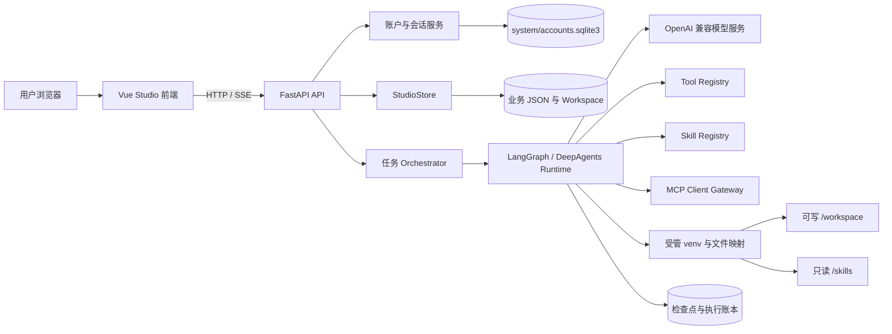
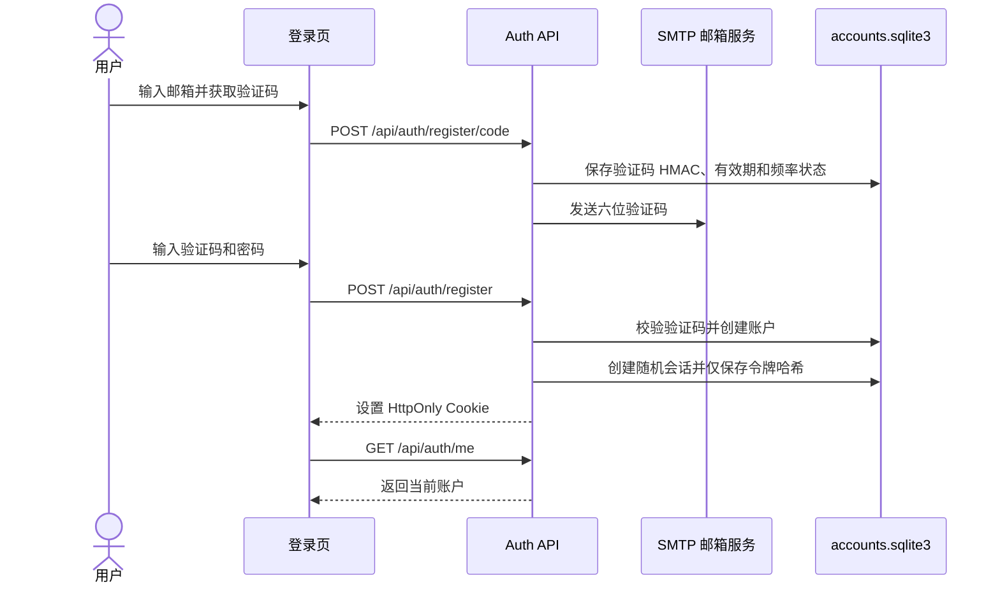
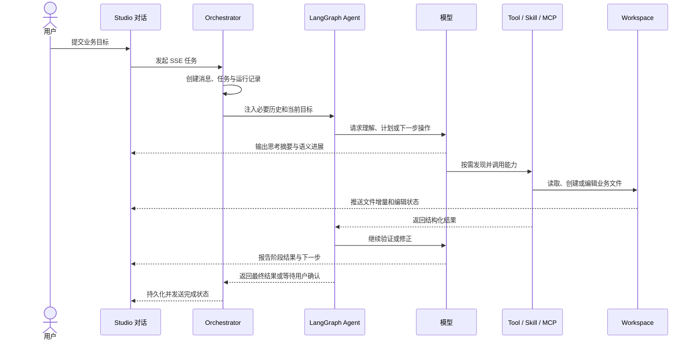

# AI Business Studio 当前实现文档

> 文档状态：当前实现基线  
> 核对日期：2026-07-21  
> 适用仓库：`business-flow-engine`  
> 信息来源：以当前代码、配置和目录结构为准，不以早期产品设想为准。

## 1. 文档目的

本文说明 AI Business Studio 到当前版本已经实现了什么、各部分如何实现、数据保存在哪里、系统怎样运行，以及当前仍有哪些明确边界。

本文是当前版本的主要实现说明。`AI_Business_Studio_Development_Document.md` 保留为历史设计与产品思路参考；当历史设计与本文或代码不一致时，以代码和本文为准。

## 2. 项目定位与不可破坏的原则

AI Business Studio 是一个以 AI 模型为执行核心的业务场景工作区。它的目标不是在平台代码里预先编排每一种业务流程，而是提供一套让模型能够理解场景、操作项目文件、调用能力并持续完成任务的基础环境，最终沉淀出可复用的业务场景能力与 Skill 包。

平台与业务能力的职责边界如下：

| 层级 | 负责内容 | 不负责内容 |
| --- | --- | --- |
| Studio 平台 | 账户与会话、业务工作区、文件增删改查、模型网关、Agent 运行时、Tool/Skill/MCP 接入、沙箱、流式事件、确认与恢复、前端呈现 | 把“关系推导”“流程推导”“Skill 生成”等业务工作写成固定次数、固定步骤的后台流程 |
| AI 模型 | 理解用户目标、检查场景资料、制定和调整计划、选择能力、验证结果、向用户报告进展 | 依靠无意义的循环次数或工具调用次数判定任务完成 |
| Tool | 提供清晰、原子的操作能力 | 承载完整业务方法论 |
| Skill | 提供完整、可复用的领域方法、参考资料、脚本与资源 | 被拆成大量孤立脚本并由平台硬编码调用顺序 |
| MCP | 连接外部系统或第三方能力 | 与 Tool、Skill 混为同一种内部协议 |

必须长期遵守以下原则：

1. 任务是否完成由业务目标、交付物和验证结果决定，不由模型或工具调用次数决定。
2. 多轮运行和上下文压缩只用于跨越真实的上下文边界，并在持久化进展后继续同一任务。
3. 用户主界面优先展示目标、阶段、结果、验证和下一步；底层 Model、Tool、Skill、MCP、Sandbox 事件只作为可展开的技术明细。
4. 平台提供“像本地项目编辑器一样工作”的操作体验，但不复制 VS Code，也不把 code-server 嵌入为产品核心。
5. 业务专用逻辑优先进入 Skill 或外部 MCP，不能持续堆积到 Studio 通用运行时代码中。

## 3. 当前能力总览

| 能力域 | 状态 | 当前实现 |
| --- | --- | --- |
| 邮箱账户 | 已实现 | 邮箱验证码注册、邮箱密码登录、会话恢复、退出登录 |
| 账户数据隔离 | 已实现 | 场景、会话、消息、运行和工作区按账户目录物理归档，所有访问按当前账户校验 |
| 业务资源管理器 | 已实现 | 多业务场景作为同级根目录，树形浏览、右键操作、键盘导航 |
| 工作区文件管理 | 已实现 | 新建、编辑、重命名、移动、删除、导入、导出、预览、原始文件读取 |
| AI 对话与执行 | 已实现 | 多会话、SSE 流式输出、计划与进度、工具调用、确认、恢复、停止 |
| 长任务续接 | 已实现 | LangGraph 检查点、语义进展检查点、上下文压缩与有限自动续接 |
| Tool | 已实现 | 动态发现 LangChain Tool，支持刷新、调用与运行追踪 |
| Skill | 已实现 | 系统 Skill 共享；用户 Skill 按账户安装、发现并形成隔离运行视图 |
| MCP | 已实现 | 按账户保存 MCP 客户端配置，支持连接测试、启停、删除和运行时调用 |
| 沙箱运行 | 已实现但有限制 | 共享受管 venv、工作区路径约束、只读 Skills 映射、超时与输出限制 |
| 动态文件编辑展示 | 已实现 | 根据文件操作事件显示草稿增量、编辑状态，并在完成后刷新正式文件 |
| 文件内容预览 | 已实现 | 文本、Markdown、Mermaid、表格、数据库、Office、PDF、媒体、压缩包等 |
| 数据关系推导 | 已实现为 Skill | `discover-data-relations` 负责证据提取、宏观关系推导和多种交付物 |
| OCR 与知识库 | 已实现为 Skill 接口 | `ocr-parser`、`vector-kb` 通过受控环境变量连接外部服务 |
| 通用 Skill 自动生成器 | 尚未固化为平台能力 | 当前由模型结合已有能力在工作区生成交付物，平台只提供包记录与下载基础设施 |
| Marketplace | 未实现 | 只存在 Skill 安装与管理能力，没有完整市场产品面 |
| 多租户能力设置 | 已实现账户级 | 环境默认模型、平台 Tool 和系统 Skill 共享；用户模型、MCP 和用户 Skill 按账户隔离 |

## 4. 总体架构



主要技术栈：

- 后端：Python、FastAPI、Pydantic、LangChain、LangGraph、DeepAgents、SQLite。
- 前端：Vue 3、TypeScript、Vite、Element Plus、Mermaid、Marked。
- 模型：OpenAI 兼容接口，可在 Studio 中维护多个模型配置。
- 持久化：业务数据使用 JSON 与普通文件；账户、检查点和执行账本使用 SQLite。

## 5. 代码目录与职责

```text
business-flow-engine/
├─ app/
│  ├─ api/                    # HTTP/SSE 接口，包含 auth、businesses、capabilities
│  ├─ auth/                   # 账户、验证码、密码、会话和鉴权依赖
│  ├─ core/                   # 环境配置、统一存储布局和旧数据迁移
│  └─ studio/
│     ├─ capabilities/        # Tool、Skill、MCP、Skill 安装与密钥
│     ├─ runtime/             # 模型适配、Agent 图、沙箱、检查点、执行账本
│     ├─ models.py            # Studio 领域模型与 API 数据模型
│     ├─ storage.py           # 业务记录、工作区、版本和文件持久化
│     ├─ orchestrator.py      # 对话任务生命周期、续接、确认和事件输出
│     ├─ settings.py          # 模型及能力配置持久化
│     ├─ file_preview.py      # 有边界的多格式文件预览
├─ frontend/src/
│  ├─ api/                    # Axios 客户端与统一错误处理
│  ├─ components/studio/      # 资源树、账户菜单等 Studio 组件
│  ├─ composables/            # 鉴权、资源操作、动态文件、分栏等状态逻辑
│  ├─ router/                 # 登录与 Studio 路由守卫
│  ├─ styles/                 # Studio 样式
│  └─ views/                  # 登录页和 Studio 主视图
├─ tools/                     # 可信的本地原子 Tool
├─ system_skills/             # 平台内置完整 Skill 包
├─ data/accounts/             # 仅保存各账户的业务场景与工作区
├─ system/                    # 账户、用户设置、运行时、沙箱、日志和迁移状态
├─ docs/                      # 当前实现与历史设计文档
├─ .env.example               # 无密钥的环境变量模板
├─ requirements.txt           # 后端依赖
└─ run.py                     # 后端启动入口
```

`app/studio` 的模块拆分遵循一个约束：通用基础设施不能反向依赖某个具体业务 Skill 的实现细节。

## 6. 账户、注册与数据隔离

### 6.1 注册和登录流程



当前安全实现：

- 邮箱统一规范化并进行格式校验。
- 密码长度限制为 8 到 128 个字符，使用带随机盐的 `scrypt` 保存。
- 注册验证码是六位数字；数据库只保存使用系统密钥计算的 HMAC，不保存验证码明文。
- 验证码具有有效期、重发间隔、每小时发送上限和最大尝试次数。
- 会话使用高熵随机令牌；数据库只保存 SHA-256 令牌哈希。
- 浏览器通过 `HttpOnly`、`SameSite=Lax` Cookie 保持会话；HTTPS 部署时应开启 `Secure`。
- 登录接口使用统一错误信息，避免直接暴露邮箱是否存在。

### 6.2 业务场景归属

`BusinessRecord.owner_id` 保存业务场景所属账户。业务场景列表、详情、工作区、文件、对话、运行、上下文和下载等接口都会从当前登录账户获取归属范围。访问其他账户的业务 ID 时按不存在处理，避免泄露资源是否存在。

为了兼容引入账户系统之前的本地数据，迁移器会根据 `business.json.owner_id` 将旧场景移动到对应账户目录；没有归属的场景先进入 `_unassigned`，由第一个成功注册的账户认领并移动。迁移不拆分场景内部数据，因此会话、消息、运行、上下文和工作区文件随场景整体保留。

能力作用域也按来源区分：环境默认模型、平台 Tool 与源码内置系统 Skill 是平台共享能力；用户在 Studio 中增加的模型、MCP 和 Skill 保存在 `system/users/<account_id>/`，其他账户不能发现或调用。共享的 Agent 检查点与执行账本属于系统基础设施，业务线程仍以不可跨账户获取的场景记录为入口。

## 7. 业务场景与工作区

### 7.1 业务记录

业务场景的核心持久化对象是 `BusinessRecord`，主要包括：

- 基础信息：ID、账户归属、名称、目标、描述、状态和时间。
- 工作数据：已登记文件、业务上下文和逻辑删除路径。
- AI 数据：聊天会话、消息、运行记录、进度事件和调用记录。
- 交付数据：版本快照和可下载包记录。

`BusinessContext` 是结构化业务语义的中心对象，包括用户需求、来源文件、实体、关系、流程、规则、术语、证据、数据血缘、假设、问题、确认以及 Tool/Skill/MCP 引用。平台不会根据这些字段自动制造默认交付物，也不会假设每个业务都必须以同样顺序填充它们。

### 7.2 场景目录

每个场景的默认结构为：

```text
data/accounts/<account_id>/<business_id>/
├─ business.json
└─ workspace/
   ├─ description.md          # 面向人和 AI 的主要业务说明
   ├─ context/                # 补充上下文材料
   ├─ data/                   # 原始或加工数据
   ├─ deliverables/           # 仅在整体场景验收后创建
   │  └─ skill-package/       # 最终能力包的约定位置
   └─ outputs/                # AI/Skill 按业务任务创建的专项交付物（可选）
```

`description.md` 是当前标准说明文件；存量 `scenario.md` 会兼容迁移。除固定基础目录外，用户和 AI 都可以根据项目需要创建任意文件和子目录。

平台不会为场景预生成实体、流程、血缘或证据图谱，也不会把 Tool、Skill、MCP 等系统能力清单投影到业务工作区。只有 AI 或 Skill 根据当前业务目标和证据实际生成的关系图谱、说明和结构化数据，才作为普通业务文件写入 `outputs/` 等任务目录并供后续流程使用。

`outputs/` 是各项推导任务的过程与阶段交付区，例如 `outputs/data-relations/`。`deliverables/skill-package/` 是终极交付区，默认不存在；只有完整业务场景已经验收且用户明确要求生成最终 Skill 能力包时才创建。任何单项推导 Skill 都不得把自己的产物复制到终极交付区。

### 7.3 文件能力

后端工作区 API 已支持：

- 获取完整目录树。
- 创建文件和文件夹。
- 更新文本文件、重命名和移动文件或目录。
- 递归删除文件或目录。
- 批量导入文件并保留相对路径。
- 导出单个文件或将目录打包为 ZIP。
- 获取受限预览或原始文件响应。

所有工作区路径都先规范化并解析到场景根目录，拒绝路径穿越、越界绝对路径和不安全的符号链接目标。

### 7.4 文件预览

当前预览器能够识别文本、源码、Markdown、Mermaid、JSON、CSV/TSV、XLSX/XLS、Parquet、SQLite、DOCX、PPTX、PDF、图片、视频、音频和常见压缩包。

预览是有边界的，不等同于完整解析：文本读取前 2 MB；表格默认最多 20 行、80 列、10 个工作表；压缩包最多列出 200 个条目；SQLite 以只读模式打开。原始文件仍可通过受保护接口获取。

### 7.5 版本与回滚

业务语义发生重要变化时，Store 会记录 `ContextVersion`，包含版本号、摘要、触发原因、执行者、模型、证据 ID 和上下文快照。API 支持查询历史版本和回滚，回滚本身也会形成新的可追踪变化，不直接抹掉历史。

## 8. AI 任务运行机制

### 8.1 一次任务的主链路



`orchestrator.py` 管理任务生命周期：保存用户消息、创建 `AIRun`、连接 LangGraph 流、转换事件、处理用户问题、写入最终消息，以及在满足条件时从语义检查点续接。

`runtime/graph.py` 负责模型与能力的实际循环，并使用 LangGraph SQLite Checkpointer 保存可恢复状态。运行过程中所有关键事件同时进入 `AIRun.events`，便于刷新页面后恢复可见进度。

### 8.2 进度而不是调用计数

模型通过 `report_task_progress` 报告业务进展。进度协议关注：当前目标、正在处理的工作项、原因、阶段结果、验证方式、产物和下一步。它不应在每次底层命令或模型调用后触发。

前端把这些语义事件显示为任务状态；Model、Tool、Skill、MCP 和 Sandbox 的原始事件保留在可展开的运行明细中。因此用户看到的是“正在完成什么”，而不是数百条基础设施日志。

### 8.3 上下文与长任务

当前采用三层控制：

1. 对话历史只带入有限的最近消息和字符数，避免无界累积。
2. DeepAgents 在单次图运行内根据阈值压缩上下文，并保留最近工作信息。
3. 只有到达真实上下文或调用边界、并且已经保存耐久语义检查点时，Orchestrator 才创建新的运行段继续同一任务。

默认模型调用上限 64、图递归上限 512、自动续接上限 4 都是故障保险，不是工作流程目标。正常任务应该尽量在一个连续任务中完成；如果模型持续调用却没有形成可恢复业务进展，仍会以失败结束，防止无限消耗。

系统提示词和工具 Schema 还有独立字符上限。Tool、Skill、MCP 目录和大量场景内容不再整体拼进 System Prompt，而是让模型在需要时发现、读取和调用，避免简单问候也产生超大请求。

### 8.4 人在回路与恢复

当任务缺少会实质改变结果的业务信息时，模型可调用 `request_user_input`。问题被写入业务上下文和运行状态，任务进入 `waiting_for_user`；用户回答后通过确认/恢复接口回到原 LangGraph 线程继续，而不是从头执行。

对于能力调用，SQLite 执行账本会先记录调用身份和状态，再保存结果。可安全重试的调用可以复用已完成结果；不确定或非幂等操作会避免盲目重复，从而降低断线、续接或检查点提交时的重复副作用。

### 8.5 主要流式事件

SSE 主链路当前包含：文本 token、推理摘要、计划、模型调用、Agent 进度、Skill 激活与资源、Sandbox 命令、文件操作、Tool 调用、澄清问题、运行交接、完成和错误。前端根据事件语义分别更新对话、进度卡、技术明细和正在打开的文件。

## 9. Tool、Skill 与 MCP

### 9.1 Tool

`tools/` 是可信本地 Tool 目录。注册表递归发现可用的 LangChain `BaseTool`，校验名称和描述，检测重名，并把导入错误显示到能力管理界面。

当前内置协议 Tool：

| Tool | 用途 |
| --- | --- |
| `report_task_progress` | 记录面向业务的任务阶段、产物、验证和下一步 |
| `request_user_input` | 发起需要用户回答的澄清或确认 |
| `manage_workspace_entry` | 新建目录/文件、移动、重命名和删除工作区条目 |

常规文件读取、搜索、编辑和命令执行由 Agent 文件系统及沙箱工具提供。Tool Python 模块在注册扫描时会被导入，因此 `tools/` 必须视为可信平台代码，不能直接安装未经审查的任意脚本。

### 9.2 Skill

Skill 以完整目录为单位，根目录必须包含 `SKILL.md`。`scripts/`、`references/`、`assets/` 和依赖声明都是该 Skill 的内部资源，脚本不会被逐个注册成 Tool。

运行时只把 Skill 概要暴露给模型；模型选择后再读取 `SKILL.md` 和所需资源。系统 Skill 来自源码目录 `system_skills/`，所有账户共享且不能通过用户接口删除。用户 Skill 安装到 `system/users/<account_id>/skills/`，只能被所属账户发现和删除。

Agent 启动前会根据内容摘要，把“系统 Skill + 当前账户用户 Skill”物化为 `system/runtime/skill-views/<account_id>/`。沙箱只挂载这一个账户专属视图为只读 `/skills/<name>`，因此其他账户的 Skill 名称、说明和文件都不会进入当前 Agent。工作产物仍写入当前场景的 `/workspace`。上传和 HTTPS ZIP 安装器会限制文件数量、单文件大小、总大小和路径，并要求显式安装同意。

当前依赖安装到 Studio 共享的受管 Python venv，不在每个场景或每个 Skill 内创建虚拟环境。安装 Skill 等于授权其脚本在受管环境中执行，仍需审查来源。

当前内置 Skill：

| Skill | 已实现用途 |
| --- | --- |
| `discover-data-relations` | 基于场景文件和业务目标提取证据、形成候选关系、推导宏观业务数据关系并生成图谱与说明 |
| `ocr-parser` | 调用配置的 OCR 服务解析扫描件或图片文档 |
| `vector-kb` | 调用配置的向量知识库检索业务知识 |

### 9.3 数据关系推导交付物

`discover-data-relations` 是业务能力，而不是 Studio 平台硬编码流程。模型根据 `SKILL.md` 选择脚本和参考资料，并在场景工作区中完成推导。它强调从证据到候选关系再到宏观业务语义，避免把所有字段匹配直接画成无法使用的密集图。

按 Skill 当前约定，典型交付物位于 `outputs/data-relations/`：

- `scenario-relationship.json`：场景级关系结论。
- `relations.json`：结构化关系集合。
- `scenario-claims.json`：已确认的业务关系主张及证据。
- `relation-report.md`：关系说明、证据、假设和限制。
- `relations.mmd`：面向整个业务场景的宏观 Mermaid 关系图。
- 证据卡、候选主张和综合分析等中间文件，用于审计和修正，不应替代最终交付物。

这些文件的准确性由模型对证据的使用、Skill 方法和最终验证共同决定，平台不会因为文件存在或调用次数达到某个值就宣布完成。

### 9.4 MCP

MCP 与 Tool、Skill 分开配置，并保存在当前账户的 `studio_settings.json`。当前管理接口支持配置规范化、连接测试、保存、启停和删除；敏感字段返回前会掩码，前端提交掩码值时后端会与当前账户已保存密钥合并。运行时只发现业务场景所属账户的 MCP，并通过能力网关按需调用，不把完整远端能力目录复制进系统提示词。

当前实现重点是作为 MCP 客户端连接外部服务。配置中保留了 `MCP_PUBLIC_BASE_URL` 和 `MCP_ACCESS_TOKEN` 字段，但当前代码没有完整实现把 Studio 作为公共 MCP Server 对外发布的产品链路，部署文档不应把它描述为已交付功能。

## 10. 沙箱与执行环境

`SandboxManager` 在业务场景之外维护一个共享 Python venv，并为每个业务场景建立逻辑运行绑定：

- `/workspace` 映射到当前业务工作区，可读写。
- `/skills` 映射到“系统 Skill + 当前账户 Skill”的账户专属视图，只读。
- `/tmp` 映射到该运行绑定的临时目录。
- Python 命令统一使用受管 venv，避免污染系统全局 Python。
- 命令具有超时、输出字节数和传输大小限制；超时后终止进程树。
- Skill 凭据只按白名单注入单次命令环境，并对可见输出执行密钥脱敏。
- 删除场景沙箱只清理该绑定和临时文件，不删除共享 venv。

必须明确：当前 `LocalVenvSandboxBackend` 提供的是路径约束和受管依赖环境，不是容器或操作系统级强隔离。它仍通过本机 Shell 执行命令。若生产环境允许不可信用户 Skill 或高风险代码，必须替换为容器、微虚机或远程执行服务，并增加资源配额、网络策略和审计。

## 11. 前端 Studio

### 11.1 布局和交互

当前 Studio 使用编辑器式工作区，但围绕业务场景而非源码 IDE 构建：

- 左侧活动栏和“业务资源管理器”。
- 业务场景直接作为同级根目录，不再额外套多层场景列表。
- 文件树支持展开、选择、键盘导航和右键菜单。
- 新建、导入、导出、重命名和删除放在资源树上下文菜单，中心文件预览保持专注。
- 中间区域以页签打开业务说明、文件、图谱和生成产物。
- 右侧为 AI 对话、任务进度和可展开技术明细。
- 支持亮色、暗色、高对比主题以及中英文界面文案。

前端已经将账户、资源树、资源操作、动态文件、分栏尺寸、复制和样式等职责拆到组件、Composable 和独立样式文件中。`StudioView.vue` 仍承担较多页面协调逻辑，后续新增功能应继续向小组件和 Composable 下沉，不能重新形成数千行单文件堆积。

### 11.2 登录体验

路由包括 `#/login` 与 `#/studio`。全局守卫先调用 `/api/auth/me` 恢复账户；未登录访问 Studio 会跳转登录页，已登录访问登录页会返回 Studio。登录页支持登录/注册模式、验证码倒计时、表单校验、响应式布局和主题切换。

### 11.3 AI 动态编辑

模型或工具写文件时，后端发送 `file_operation` 增量事件。`useLiveWorkspaceFiles` 为正在编辑的文件维护草稿、增量内容和可见写入节奏；如果该文件已经在中间区域打开，编辑内容会逐步更新，而不是只显示一个长期不消失的“正在编辑”。收到完成事件后，前端重新获取正式文件、结束草稿状态并刷新资源树。

动态效果依赖能力使用受支持的文件写入链路并产生文件事件。外部程序绕开 Studio 直接修改磁盘时，目前只能通过后续刷新看到最终结果，无法天然获得逐字符事件。

## 12. HTTP API 分组

除健康检查和注册/登录相关端点外，业务与能力接口都通过 `require_account` 保护。

| 分组 | 主要路径 | 说明 |
| --- | --- | --- |
| 健康检查 | `GET /api/health` | 版本、模型可用性和前端构建状态 |
| 账户 | `/api/auth/*` | 验证码、注册、登录、当前账户、退出 |
| 业务场景 | `/api/businesses` | 创建、列表、详情、更新、删除 |
| 工作区 | `/api/businesses/{id}/workspace/*` | 树、预览、原始文件、条目 CRUD、导入导出 |
| 登记文件 | `/api/businesses/{id}/files`、`/api/files/{id}/*` | 上传解析、列表、预览、读取、删除 |
| AI 对话 | `/api/businesses/{id}/chat*` | 普通/流式对话、会话、恢复、消息和运行 |
| 人工确认 | `/api/businesses/{id}/confirmations` | 回答 Agent 问题并恢复任务 |
| 业务上下文 | `/api/businesses/{id}/context*` | 读取、更新、版本和回滚 |
| 沙箱 | `/api/businesses/{id}/sandbox/*` | 状态、准备和清理场景绑定 |
| 能力 | `/api/tools`、`/api/skills` | 共享 Tool、系统 Skill 和当前账户用户 Skill |
| Studio 设置 | `/api/settings`、`/api/models/*` | 当前账户的模型和能力设置 |
| MCP | `/api/mcp-servers*` | 当前账户 MCP 的测试、保存、启停和删除 |
| 交付包 | `/api/packages/{id}/download` | 下载已经登记的业务能力包 |

具体请求字段以 `app/studio/models.py`、`app/auth/models.py` 和 FastAPI 自动生成的 `/docs` 为准。

## 13. 持久化与运行数据

默认关键数据位置：

```text
data/
└─ accounts/<account_id>/<business_id>/
   ├─ business.json
   └─ workspace/**

system/
├─ accounts.sqlite3
├─ users/<account_id>/
│  ├─ studio_settings.json     # 用户模型与 MCP
│  ├─ installed_skills.json    # 用户 Skill 所有权元数据
│  └─ skills/**                # 用户安装的完整 Skill 包
├─ studio/
│  ├─ skill_secrets.json       # 系统 Skill 的服务端凭据
│  └─ legacy_*                 # 升级时保留的旧设置
├─ runtime/
│  ├─ agent/
│  │  ├─ checkpoints.sqlite3
│  │  └─ tool_ledger.sqlite3
│  ├─ sandbox/
│  │  ├─ python/               # 共享受管 venv
│  │  └─ tmp/                  # 各运行绑定临时目录
│  └─ skill-views/<account_id>/
├─ logs/
├─ migrations/
└─ legacy/
```

其中：

- `business.json` 是单个业务场景的元数据、上下文、消息、运行和版本记录。
- `workspace/**` 是用户和 AI 实际操作的项目文件。
- `checkpoints.sqlite3` 保存 LangGraph 可恢复状态。
- `tool_ledger.sqlite3` 保存能力调用的幂等与结果状态。
- 每个账户的 `studio_settings.json` 保存该账户增加的模型和 MCP 设置。
- `installed_skills.json` 与 `skills/**` 保存该账户安装的 Skill 所有权和完整目录。
- `skill-views/**` 是可重建的账户能力视图，不是业务数据。
- `skill_secrets.json` 保存系统 Skill 需要由服务端注入的凭据，接口返回时会掩码。
- `accounts.sqlite3` 保存账户、验证码状态和会话令牌哈希。

`data/`、`system/` 和 `.env` 都不应提交到 Git，但它们是本地实例状态，做版本备份时不能只备份源码。

### 13.1 旧目录自动迁移

存储布局版本 2 会在服务启动时幂等迁移旧目录：业务场景从 `data/business_studio/businesses/` 进入账户目录；运行时数据库、共享 venv、设置、Skill 密钥和日志进入 `system/`。目标已存在时不会覆盖，冲突源会保存在 `system/migrations/conflicts/`；无法识别为有效场景的旧目录保存在 `system/legacy/unmigrated-businesses/`。迁移结果记录在 `system/migrations/storage-layout-v2.json`。

迁移结束后，`data/` 的直接业务结构固定为 `accounts/<account_id>/<business_id>`，系统运行文件不得重新写回 `data/`。

## 14. 配置

从 `.env.example` 复制得到 `.env`，至少配置以下类别：

| 类别 | 关键变量 | 说明 |
| --- | --- | --- |
| 模型 | `OPENAI_API_KEY`、`OPENAI_BASE_URL`、`LLM_MODEL` | OpenAI 兼容模型服务 |
| Agent 边界 | `AGENT_MODEL_CALL_LIMIT` 等 | 安全上限和上下文阈值，不是目标调用次数 |
| 数据目录 | `DATA_DIR`、`SYSTEM_DIR` | 业务与系统数据根目录 |
| 账户 | `JWT_SECRET`、`JWT_EXPIRE_HOURS`、`AUTH_COOKIE_*` | 验证码 HMAC 密钥和会话配置 |
| 邮箱 | `MAIL_SERVER`、`MAIL_PORT`、`MAIL_USERNAME`、`MAIL_PASSWORD` | 注册验证码 SMTP |
| 沙箱 | `SANDBOX_ROOT`、`SANDBOX_COMMAND_TIMEOUT`、`SANDBOX_OUTPUT_LIMIT` | 受管运行环境 |
| Skill 服务 | `OCR_*`、`VECTOR_KB_*` | 只对白名单 Skill 注入 |
| MCP | `MCP_PUBLIC_BASE_URL`、`MCP_ACCESS_TOKEN` | 预留对外交付配置，当前非完整公共服务功能 |

生产环境要求：

1. 使用随机高强度 `JWT_SECRET`，不能保留示例值。
2. 使用 HTTPS 并设置 `AUTH_COOKIE_SECURE=true`。
3. SMTP 授权码、模型密钥、Skill 密钥只写入 `.env` 或专用密钥服务，禁止进入 Git 和文档。
4. 限制服务监听地址、反向代理、上传体积和运行环境网络访问。

## 15. 本地启动

建议使用 Python 3.11 或更高版本和当前 LTS Node.js。

```powershell
python -m venv .venv
.\.venv\Scripts\Activate.ps1
pip install -r requirements.txt
Copy-Item .env.example .env
```

完成 `.env` 配置后启动后端：

```powershell
python run.py
```

默认后端地址为 `http://127.0.0.1:8000`，接口文档为 `http://127.0.0.1:8000/docs`。

开发模式启动前端：

```powershell
Set-Location frontend
npm install
npm run dev
```

默认开发地址为 `http://127.0.0.1:5173/#/studio`。生产构建执行：

```powershell
npm run build
```

当 `frontend/dist` 存在时，FastAPI 会在根路径托管前端静态文件。

首次真正执行 Python Skill 时，Studio 自动创建共享受管 venv，首次准备时间会明显长于普通对话。

## 16. 验证与验收

当前仓库没有一套随代码提交的完整自动化回归测试，因此每次小版本至少执行以下检查：

1. 后端模块导入与语法检查能够通过。
2. `frontend` 下执行 `npm run build`，确保 TypeScript 检查和 Vite 构建通过。
3. 新邮箱能够收到验证码、完成注册、刷新恢复登录并退出。
4. 两个账户互相看不到对方业务场景；猜测其他业务 ID 返回 404。
5. 两个账户的用户模型、MCP、用户 Skill 和 Agent `/skills` 视图互不可见，系统 Skill 都可见。
6. 在资源树中完成文件夹/文件创建、编辑、移动、导入、导出和删除。
7. AI 写入已打开文件时，中间区域显示增量内容，完成后状态消失且文件内容一致。
8. 一个短对话不会携带完整 Tool/Skill/MCP 目录或整个场景快照，System Prompt 保持在限制内。
9. 长任务到达上下文边界时先保存语义进展，再续接；没有进展时不会无限循环。
10. 数据关系任务生成宏观 `relations.mmd`、结构化 JSON 和说明 Markdown，并能回溯到证据。
11. 重启后端后，账户、场景、消息、工作区和可恢复运行仍然存在。

临时测试数据和测试目录不得提交仓库；正式建立测试套件时，应把可复用测试代码放入明确的测试工程并重新调整忽略规则。

## 17. 备份与恢复

### 17.1 小版本备份范围

完整备份至少包括：

- Git 中的源代码、`system_skills/`、`tools/` 和文档。
- `data/accounts/` 中所有账户业务记录和工作区。
- `system/accounts.sqlite3`、`system/users/` 和 `system/studio/`。
- `system/runtime/agent/` 中的检查点和执行账本。
- `system/migrations/` 与仍需确认的 `system/legacy/`。
- `.env`，但必须进入受控密钥备份，不能放入普通源码压缩包或 Git。

共享 `system/runtime/sandbox/python` 与 `system/runtime/skill-views/` 可以重建；若不备份 venv，恢复后首次运行 Skill 会重新准备依赖。`system/users/<account_id>/skills/` 是用户实际安装的能力包，必须备份。

### 17.2 恢复顺序

1. 恢复与备份版本一致的源代码。
2. 恢复 `data/` 与 `system/`，确保文件权限允许服务账户读写。
3. 恢复 `.env` 或重新注入同一组密钥；验证码 HMAC 和现有配置解密/校验依赖相关密钥的一致性。
4. 安装 Python 和前端依赖，必要时让 Studio 重建受管 venv。
5. 启动后先检查 `/api/health`，再验证登录、业务列表、文件预览和一条只读 AI 任务。

复制运行中的 SQLite 文件可能得到不一致快照。正式备份应先停止写入，或使用 SQLite 在线备份机制。

## 18. 当前已知边界与后续方向

这些内容当前没有完全实现，不能在对外说明中写成已交付：

1. 账户只有邮箱注册和密码登录，没有找回密码、修改密码、注销账户、角色、组织、管理员和双因素认证。
2. 当前隔离层级是账户，不是组织/团队；平台 Tool、系统 Skill 和环境默认模型按设计共享，尚无管理员授权矩阵。
3. 业务 Store 以单机场景 JSON 为核心，不适合多进程并发写入或大规模分布式部署。
4. venv 沙箱不是强安全隔离，不适合直接运行完全不可信代码。
5. 平台没有通用、固定的“自动生成所有业务 Skill 包”流水线；正确方向仍是让模型组合 Skill、Tool、MCP 完成并验证交付物。
6. MCP 公共托管服务链路尚未完整实现。
7. Marketplace、组织协作、权限矩阵、任务队列、分布式 Worker、对象存储和源码版本控制集成尚未实现。
8. 前端已经开始组件化，但 Studio 主视图仍需继续拆分页面协调职责。
9. 缺少正式、持续运行的后端与端到端自动化测试套件。

推荐演进顺序：

1. 先建立账户、工作区、Agent 长任务和文件事件的自动化回归测试。
2. 在现有账户隔离之上增加组织作用域、共享授权和管理员权限。
3. 将业务 JSON Store 迁移为有事务和并发控制的数据层，同时保留工作区普通文件语义。
4. 抽象 Sandbox Provider，增加容器或远程强隔离实现。
5. 继续拆分 `StudioView`，让每个面板、会话和流式事件域拥有独立组件与 Composable。
6. 在真实业务任务上评估 Skill 交付物质量，而不是用调用次数、消息数量或固定阶段数量评价 Agent。

## 19. 文档维护规则

1. 新增重要功能时，同时更新“能力总览”“代码目录”“API”“配置”和“已知边界”中受影响的部分。
2. 尚未合并或只存在设想的功能必须标记为“计划”或“未实现”。
3. 任何涉及密钥、邮箱授权码、模型 Token 或用户业务数据的示例都只能使用占位符。
4. 当目录、默认路径或环境变量发生变化时，以同一次代码变更更新本文。
5. 历史设计文档可以保留讨论价值，但不能覆盖当前实现文档的事实状态。
